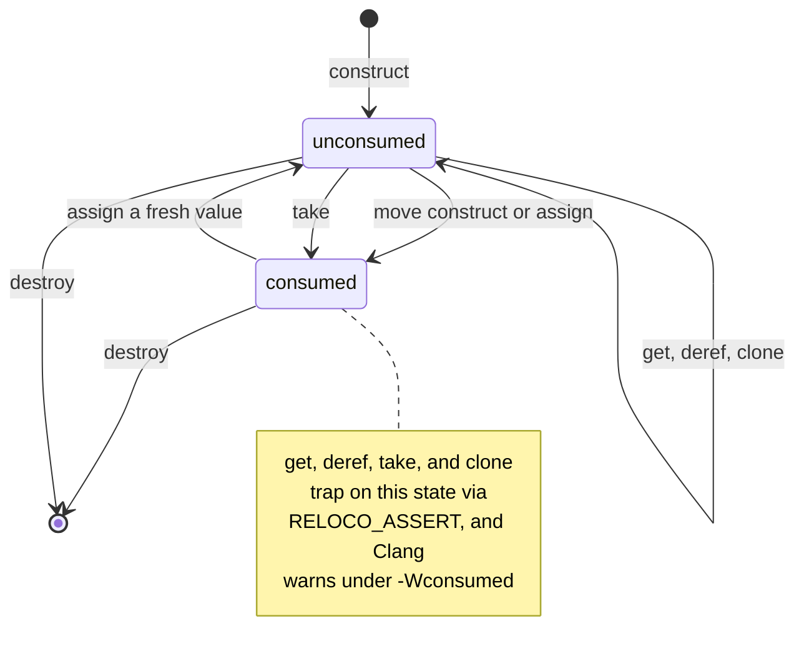
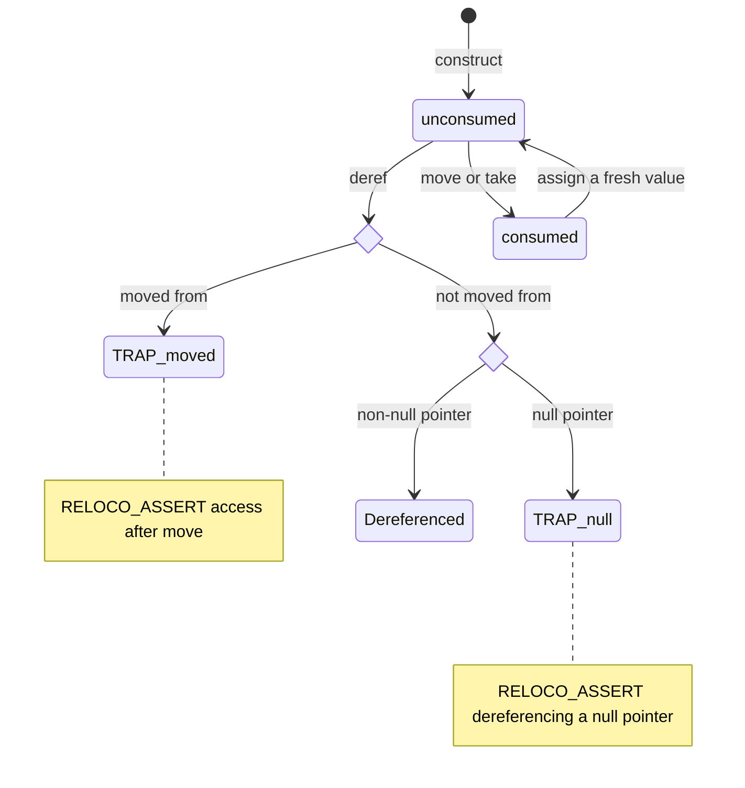

<!--
SPDX-FileCopyrightText: 2026 Jarosław Pelczar <jarek@jpelczar.com>

SPDX-License-Identifier: BSD-2-Clause
-->

# Lifetime safety, `value_ref`, and `value_ptr`

reloco combines type-level borrowing rules with optional compiler
annotations. The type system provides portable enforcement, while annotations
give supporting compilers additional information for diagnostics and static
analysis.

## Borrow persistent values with `value_ref`

`reloco::value_ref<T>` is a small, non-null reference wrapper for values
stored in type-erased metadata, registries, tasks, and other non-owning
structures. It accepts compatible lvalues and rejects rvalues:

```cpp
#include <reloco/value_ref.hpp>

task_metadata metadata{42};
reloco::value_ref ref(metadata);

consume(*ref);
consume(ref->id);

// Rejected: the temporary would be destroyed at the semicolon.
// reloco::value_ref dangling(task_metadata{42});
```

The wrapper stores only a pointer and does not extend the referenced object's
lifetime. The owner must outlive the `value_ref` and every copy of it.
`value_ref<T>` preserves mutable access to a mutable lvalue;
`value_ref<const T>` provides an explicitly read-only borrow:

```cpp
device state{};
reloco::value_ref<device> mutable_state(state);
mutable_state->reset();

reloco::value_ref<const device> observed_state(state);
inspect(*observed_state);
```

Class-template argument deduction preserves the lvalue's type, including
`const`. Explicit `value_ref<Base>` construction also accepts an lvalue of a
publicly derived type. Unrelated types and temporary values are rejected at
compile time.

The inspector's `concrete_metadata_map` uses `value_ref` to store
heterogeneous borrowed properties. See
[Inspector: metadata maps](inspector/metadata.md) for storage, iteration, and
formatting lifetime requirements.

`value_ref` is part of the main library interface rather than the inspector
subdirectory. Read-only adapters such as `hash_view`, `variant_view`, and the
`{fmt}` compatibility output iterator store `value_ref<const T>` explicitly.

`value_ref` never needs its own "unsafe" tier: its invariant (constructed only
from a valid lvalue, with no way to become null or dangle afterward) makes a
null check provably redundant, so `operator*` dereferences through
`value_ptr::unsafe_deref()` internally, wrapped in
`RELOCO_BEGIN_UNSAFE_BUFFER_USAGE`/`RELOCO_END_UNSAFE_BUFFER_USAGE`,
rather than paying for `value_ptr`'s checked-tier null guard on every access.
This is the same trade-off a hot-path caller makes explicitly with
`unsafe_deref()`, just applied once, centrally, by a wrapper whose own type
already proves the precondition.

## Store nullable borrows with `value_ptr`

`reloco::value_ptr<T>` is a nullable, non-owning pointer wrapper. It retains
ordinary pointer size and trivial-copy behavior while marking the type as
`RELOCO_POINTER` and marking raw-pointer construction and borrowed accessors
with `RELOCO_LIFETIMEBOUND`.

```cpp
device state{};
reloco::value_ptr<device> ptr(&state);

if (ptr) {
  ptr->reset();
}
```

`operator*` and `operator->` assert that the pointer is non-null before
dereferencing (`RELOCO_ASSERT`, the same "Checked" tier every other hardened
container in this library defaults to), so passing a null `value_ptr` into
them traps instead of silently invoking undefined behavior. Use `get()` or
`operator bool()` first when the pointer may be null and you want to avoid
even the trap:

```cpp
reloco::value_ptr<device> maybe(nullptr);
if (device *raw = maybe.get()) {
  raw->reset();
}
```

`unsafe_deref()` is the explicitly-unsafe tier: it only pays for a
`RELOCO_DEBUG_ASSERT`, which compiles out entirely under `NDEBUG` (unless
`RELOCO_DEBUG` is also defined), so it still catches bugs in debug and test
builds but has zero overhead once the null check has already been proven
elsewhere. It is additionally marked `RELOCO_UNSAFE_BUFFER_USAGE`, so under
Clang's `-Wunsafe-buffer-usage` every call site must be wrapped in
`RELOCO_BEGIN_UNSAFE_BUFFER_USAGE`/`RELOCO_END_UNSAFE_BUFFER_USAGE` —
making each opt-out explicit and greppable, not just documented in a comment:

```cpp
reloco::value_ptr<device> ptr(&state);
if (ptr) {
  RELOCO_BEGIN_UNSAFE_BUFFER_USAGE
  ptr.unsafe_deref().reset(); // already proven non-null just above
  RELOCO_END_UNSAFE_BUFFER_USAGE
}
```

Use `value_ref` when null is not a valid state and read-only access is enough.
Use `value_ptr` for optional references, mutable pointees, type-erased context
storage, and objects that must be rebound or default-constructed before a
context is available. Neither wrapper owns or extends the lifetime of the
pointed object.

The library uses `value_ptr` for retained type-erased inspector contexts,
symbol-resolution contexts, callback and container targets, metadata value
pointers, and PMR resources. Owning allocation links, static virtual tables,
and public C-style callback ABI fields remain raw pointers.

## Lifetime annotations

`reloco/lifetime.hpp` defines portable annotation macros:

| Macro | Meaning |
|---|---|
| `RELOCO_LIFETIMEBOUND` | A returned or stored borrow cannot outlive the annotated source |
| `RELOCO_OWNER` | The annotated type owns the storage reached through it |
| `RELOCO_POINTER` | The annotated type is a non-owning pointer-like wrapper |
| `RELOCO_UNSAFE_BUFFER_USAGE` | Marks a low-level function using intentionally unchecked buffer operations |
| `RELOCO_LIFETIME_CAPTURE_BY(...)` | Declares that one or more named parameters retain a borrow |
| `RELOCO_LIFETIME_CAPTURE_BY_THIS` | Declares that an object retains a constructor or member-function argument |
| `RELOCO_NONNULL(...)` | Declares pointer parameters that must not be null |
| `RELOCO_ATTR_ACCESS(...)` | Describes pointer access direction to GCC and Clang |
| `RELOCO_ATTR_ACCESS_SIZE(...)` | Associates pointer access with a size parameter |
| `RELOCO_NONSTRING` | Marks a character array as raw storage rather than a NUL-terminated string |
| `RELOCO_MALLOC_PAIR(...)` | Associates a GCC allocator with its matching deallocator |
| `RELOCO_ASSUME_ALIGNED(...)` | States the minimum alignment of a returned pointer |
| `RELOCO_DIAGNOSE_IF(...)` | Adds a Clang call-site diagnostic for an invalid argument condition |
| `RELOCO_MUSTTAIL` | Requires a Clang tail call when placed on a return statement |
| `RELOCO_COLD`, `RELOCO_HOT` | Marks whole functions as unlikely or likely execution paths |
| `RELOCO_CONSUMABLE(...)` and typestate macros | Describes monotonic object states to Clang's consumed analysis |

The macros expand to compiler attributes when supported and otherwise expand
to nothing. They must therefore improve diagnostics without changing program
semantics or becoming the only enforcement of a lifetime rule.

Use the stronger contract macros only when their requirements hold on every
path. `RELOCO_ASSUME_ALIGNED` makes misaligned returns undefined behavior,
`RELOCO_MUSTTAIL` requires ABI-compatible caller and callee signatures, and
the consumable-state macros suit one-way state transitions rather than
resettable or idempotent objects. `RELOCO_MALLOC_PAIR` is for heap-like GCC
allocators that pair an allocation function with its matching deallocator; it
does not apply to non-owning views such as `span` or `string_view`.

### Consumed-state (`-Wconsumed`) annotations

`RELOCO_CONSUMABLE`, `RELOCO_CALLABLE_WHEN`, `RELOCO_SET_TYPESTATE`, and
`RELOCO_RETURN_TYPESTATE` describe monotonic "unconsumed → consumed" object
states to Clang's `-Wconsumed` analysis. They suit RAII writers or builders
with a close/finalize operation after which further writes are invalid, such
as a transaction with a terminal `commit()`:

```cpp
class RELOCO_CONSUMABLE(unconsumed) transaction_writer {
public:
  explicit transaction_writer(connection &conn) noexcept
      RELOCO_RETURN_TYPESTATE(unconsumed);

  transaction_writer &write(reloco::string_view row) noexcept
      RELOCO_CALLABLE_WHEN("unconsumed");

  void commit() noexcept RELOCO_CALLABLE_WHEN("unconsumed", "consumed")
      RELOCO_SET_TYPESTATE(consumed);
};
```

Every constructor that yields a fresh, usable object — including move
constructors — needs an explicit `RELOCO_RETURN_TYPESTATE(unconsumed)`;
without it, Clang treats the object as already consumed and warns on the
first legitimate call. Idempotent close/finalize methods should list every
state from which they may legally be called (for example
`RELOCO_CALLABLE_WHEN("unconsumed", "consumed")`) so that a repeat call from
a destructor is not itself flagged. Unlike `RELOCO_CONSUMABLE`,
`RELOCO_SET_TYPESTATE`, and `RELOCO_RETURN_TYPESTATE`, which take bare
state identifiers, `RELOCO_CALLABLE_WHEN` requires its state names as
quoted string literals.

Clang's consumed analysis cannot see through a reference or pointer parameter:
an object arriving as `transaction_writer &` (for example a callback
parameter) starts in the `unknown` state rather than `unconsumed`, so calling
a write method directly on it warns even though the object is genuinely
fresh. Types like this can expose an `as_known()` helper for exactly this
boundary — it is callable from `unconsumed` or `unknown`, asserts the real
runtime invariant, and returns to `unconsumed` so the rest of the chain is
tracked normally:

```cpp
with_transaction([](transaction_writer &event) {
  event.as_known().write("boot").write("sequence=7");
});
```

Reach for `as_known()` only at boundaries where the parameter or member truly
is unconsumed by construction (as callback parameters freshly constructed by
the caller are); it is a targeted escape hatch for Clang's analysis limits,
not a way to silence a genuine reuse-after-`end()` warning.

### Adding consumed-state tracking to your own type

Consumed-state analysis is a good fit whenever a type has a genuine one-way
"finished" transition after which further calls are a bug — a scoped writer,
a builder with a terminal `build()`/`commit()`, a single-use token, a
transaction that must be committed or rolled back exactly once, and so on. It
is a poor fit for types that can be reset, reused, or whose state changes
depend on runtime data the analysis cannot see (see "When not to use it"
below).

1. **Pick your states.** Most types only need Clang's two built-in names,
   `unconsumed` and `consumed`. Only introduce a third custom state name if
   you truly have more than one live/finished mode to distinguish; Clang
   accepts arbitrary identifiers here, but `as_known()`-style escape hatches
   (step 5) only make sense against `unknown`, which is always available.

2. **Mark the class `RELOCO_CONSUMABLE(unconsumed)`** so every instance
   starts tracked as fresh by default:

   ```cpp
   #include <reloco/lifetime.hpp>

   class RELOCO_CONSUMABLE(unconsumed) transaction {
     // ...
   };
   ```

3. **Annotate every constructor that must yield a fresh object** —
   including copy/move constructors if the type is copyable/movable — with
   `RELOCO_RETURN_TYPESTATE(unconsumed)`. Skipping this is the most common
   mistake: without it, Clang treats freshly-constructed objects as already
   consumed and warns on the very first legitimate call.

   ```cpp
   explicit transaction(connection &c) noexcept RELOCO_RETURN_TYPESTATE(unconsumed)
       : conn_(c) {}

   transaction(transaction &&other) noexcept RELOCO_RETURN_TYPESTATE(unconsumed)
       : conn_(other.conn_), committed_(other.committed_) {
     other.committed_ = true; // the moved-from object is spent too
   }
   ```

4. **Mark every method that must not be called after the terminal
   transition** with `RELOCO_CALLABLE_WHEN("unconsumed")` (note the quoted
   string — this macro alone requires it, unlike the others above):

   ```cpp
   void write(reloco::string_view row) noexcept RELOCO_CALLABLE_WHEN("unconsumed") {
     conn_->send(row);
   }
   ```

5. **Mark the terminal method(s)** with `RELOCO_SET_TYPESTATE(consumed)`.
   If the same method may legitimately run more than once (an idempotent
   `close()`/`end()` called from both user code and a destructor), list every
   state it may be called from instead of only `"unconsumed"`:

   ```cpp
   void commit() noexcept RELOCO_CALLABLE_WHEN("unconsumed", "consumed")
       RELOCO_SET_TYPESTATE(consumed) {
     if (!committed_) {
       conn_->flush();
       committed_ = true;
     }
   }

   ~transaction() noexcept { commit(); } // safe: commit() allows "consumed" too
   ```

   Keep a runtime guard (`committed_`/`closed_` or similar) behind every
   state-changing method regardless of the annotations — the attributes are a
   compile-time diagnostic aid for supporting compilers, not a substitute for
   the actual runtime check that keeps behavior correct everywhere else,
   including GCC and older Clang.

6. **Add an `as_known()` escape hatch only if your type is commonly received
   through a reference or pointer parameter** whose state Clang cannot infer
   (a callback argument, a member accessed through `this`, a function
   parameter). Make it callable from both `"unconsumed"` and `"unknown"`,
   assert the real runtime invariant with `RELOCO_ASSERT` from
   `<reloco/detail/assert.hpp>`, and return to `"unconsumed"`:

   ```cpp
   transaction &as_known() noexcept & RELOCO_CALLABLE_WHEN("unconsumed", "unknown")
       RELOCO_RETURN_TYPESTATE(unconsumed) {
     RELOCO_ASSERT(!committed_, "transaction already committed");
     return *this;
   }
   ```

   Skip this step if the type is always used as a local variable; it is only
   needed to unblock Clang at boundaries where the state genuinely cannot be
   tracked.

7. **Verify with `clang++ -Wconsumed -fsyntax-only`**: write one test that
   calls a tracked method after the terminal transition and confirm it
   warns, and one that exercises normal usage (including any `as_known()`
   boundary) and confirms it stays silent. GCC silently ignores every one of
   these macros, so this step is the only way to validate the annotations
   actually do anything.

### Applying consumed-state to a generic container or wrapper

Template containers and RAII wrappers can use the same macros; the attributes
apply per-instantiation, so no extra plumbing is needed for the template
parameter itself. The one caveat is annotating out-of-class member-function
definitions: Clang applies the attributes from the first declaration it sees
(usually the in-class declaration), so it is enough to annotate that
declaration once — repeating the same attributes on an out-of-line definition
is optional but harmless as long as the text matches exactly.

```cpp
template <typename T>
class RELOCO_CONSUMABLE(unconsumed) scoped_handle {
public:
  explicit scoped_handle(T resource) noexcept RELOCO_RETURN_TYPESTATE(unconsumed)
      : resource_(std::move(resource)) {}

  scoped_handle(scoped_handle &&other) noexcept RELOCO_RETURN_TYPESTATE(unconsumed)
      : resource_(std::move(other.resource_)), released_(other.released_) {
    other.released_ = true;
  }

  [[nodiscard]] T &get() noexcept RELOCO_CALLABLE_WHEN("unconsumed") { return resource_; }

  void release() noexcept RELOCO_CALLABLE_WHEN("unconsumed", "consumed")
      RELOCO_SET_TYPESTATE(consumed) {
    if (!released_) {
      resource_.close();
      released_ = true;
    }
  }

  ~scoped_handle() noexcept { release(); }

private:
  T resource_;
  bool released_{false};
};
```

For a heterogeneous container that owns many consumable elements (for
example a pool of `transaction` objects), annotate the element type itself
rather than the container: Clang's consumed analysis tracks individual
local variables and data members, not elements reached through a container's
`operator[]` or iterators, so annotating the container class adds no
additional coverage.

### `checked_value<T>`: a ready-made consumed-state type

`<reloco/checked_value.hpp>` is a concrete, ready-to-use implementation of
the pattern described above: a move-only wrapper that gives a value of type
`T` best-effort, Rust-like use-after-move checking, on every compiler at
runtime and additionally at compile time under Clang's `-Wconsumed`. Reach
for it instead of hand-rolling the pattern from scratch whenever "moved-from
values must not be used again" is the invariant you need.

Every instance is in one of two typestates:

- **`unconsumed`** — the value is present and every accessor is callable.
- **`consumed`** — the value has been moved out (via the move
  constructor/assignment or `take()`); further access traps at runtime via
  `RELOCO_ASSERT`, and Clang additionally reports it statically.



The only way back from `consumed` to `unconsumed` is assigning a fresh
`checked_value` into the moved-from slot — exactly like reassigning a moved-
from Rust binding revives it as a new owned value:

```cpp
reloco::checked_value<int> a(1);
reloco::checked_value<int> b(std::move(a)); // a: unconsumed -> consumed
a.get();                                      // traps + -Wconsumed warning

a = reloco::checked_value<int>(99);         // a: consumed -> unconsumed
a.get();                                      // fine again: 99
```

`checked_value<T *>` (the partial specialization for raw pointers) adds a
second, orthogonal axis: nullability. It keeps the same two-state
`unconsumed`/`consumed` typestate as the primary template, but its
dereferencing operators (`operator*`, `operator->`) additionally check the
pointer value itself, independent of the typestate:



Because `get()`, `is_null()`, and `operator bool()` never dereference the
pointer, they only need the first check (`moved_from_`) and are safe to call
on a null pointer to test it before reaching for `operator*`/`operator->`:

```cpp
reloco::checked_value<widget *> p(maybe_null_widget());
if (p) {                 // operator bool(): moved_from_ check only
  p->render();            // operator->(): moved_from_ check + null check
}
```

`take()` on the pointer specialization additionally nulls the source's
pointer slot (on top of setting `moved_from_`), so even a disabled assert
(`RELOCO_DISABLE_ASSERT`) degrades to a safe null dereference rather than
reading stale memory — the same defense-in-depth `std::unique_ptr` gives its
moved-from state.

CTAD cannot select the pointer specialization from a bare `nullptr` literal:
`checked_value b(nullptr);` would deduce the unhelpful
`checked_value<std::nullptr_t>` (no null-checking at all), so that
instantiation is rejected with a `static_assert` pointing at the fix. Name
the pointee type explicitly instead:

```cpp
reloco::checked_value<widget *> p(nullptr); // OK: picks the T* specialization
```

Both the primary template and the pointer specialization also offer an
explicitly-unsafe tier: `unsafe_get()` (both templates) and `unsafe_deref()`
(pointer specialization only) skip `get()`/`operator*`/`operator->`'s
`RELOCO_ASSERT` in favor of `RELOCO_DEBUG_ASSERT`, which compiles out
under `NDEBUG` (unless `RELOCO_DEBUG` is also defined). Use them only once
`unconsumed` state (and, for pointers, non-null) is already established —
for example, right after construction, or once `-Wconsumed` has statically
proven it — and the checked accessor's overhead is unacceptable on a hot
path. Like `value_ptr::unsafe_deref`, both are marked
`RELOCO_UNSAFE_BUFFER_USAGE`, so every call site must be wrapped in
`RELOCO_BEGIN_UNSAFE_BUFFER_USAGE`/`RELOCO_END_UNSAFE_BUFFER_USAGE`:

```cpp
reloco::checked_value<widget *> p(&some_widget);

RELOCO_BEGIN_UNSAFE_BUFFER_USAGE
p.unsafe_deref().render(); // already known unconsumed and non-null
RELOCO_END_UNSAFE_BUFFER_USAGE
```

See `include/reloco/checked_value.hpp` and `tests/test_checked_value.cpp`
for the full API (`take()`, `clone()`, `as_known()`) and worked examples.

### `RELOCO_UNSAFE_BUFFER_USAGE` covers the whole library, not just these types

The explicitly-unsafe tier described above is not unique to `value_ptr`,
`value_ref`, and `checked_value`. Every pre-existing `unsafe_*` accessor in
the hardened containers — `array::unsafe_at`/`unsafe_front`/`unsafe_back`,
`span::unsafe_subspan`/`unsafe_data`/`unsafe_at`/`unsafe_front`/
`unsafe_back`/`unsafe_first`/`unsafe_last`, and
`string_view::unsafe_front`/`unsafe_back`/`unsafe_substr`/`unsafe_data`/
`unsafe_remove_prefix`/`unsafe_remove_suffix` — is also marked
`RELOCO_UNSAFE_BUFFER_USAGE`. This makes the whole library's
explicitly-unsafe tier uniformly enforced: an unwrapped call to *any*
`unsafe_*` method, anywhere, is a Clang `-Wunsafe-buffer-usage` diagnostic,
not just a documented convention. `scripts/check-unsafe-buffer-usage.sh` is
the acceptance gate that keeps this at zero diagnostics.

### When not to use it

- The object can be freely reset or reused (state is not monotonic).
- The terminal transition depends on data the compiler cannot see (for
  example, a network response deciding whether the object is still usable) —
  model that with a runtime check and a normal return value instead.
- The type is only ever accessed through type-erased function pointers or
  virtual dispatch that Clang's local, syntactic analysis cannot follow; keep
  the runtime guard as the sole enforcement there.

Strict Clang builds explicitly enable the supported `-Wdangling`,
`-Wdangling-gsl`, `-Wdangling-assignment-gsl`, `-Wdangling-field`,
`-Wreturn-stack-address`, and `-Wconsumed` diagnostics. CMake probes each flag
before adding it, so older Clang and AppleClang releases remain supported.
These diagnostics are treated as errors when
`JPLCZ_RELOCO_ENABLE_STRICT_WARNINGS` is enabled.

Clang's `-Wunsafe-buffer-usage` is a separate bounds-migration analysis. It is
not part of the default warning set because reloco deliberately contains
audited low-level buffer primitives. Use the unsafe-buffer annotation and
pragma macros below when running that analysis separately.

Run the current Clang migration check with:

```bash
./scripts/check-unsafe-buffer-usage.sh
```

The check covers the public headers in C++17, C++20, and C++23 modes. It
always prints the full diagnostic report for each standard, plus a per-file
warning-count summary, and fails if any standard produces more than
`RELOCO_UNSAFE_BUFFER_MAX_WARNINGS` (default `0`) diagnostics — i.e. the
headers must be entirely clean of unsafe-buffer-usage warnings by default.
Raise `RELOCO_UNSAFE_BUFFER_MAX_WARNINGS` temporarily while migrating a
batch of call sites.

Use `RELOCO_LIFETIMEBOUND` on parameters or accessors whose result borrows
from an input or from `*this`. Mark owning containers with `RELOCO_OWNER`
and non-owning views or reference wrappers with `RELOCO_POINTER`. Add
`RELOCO_LIFETIME_CAPTURE_BY_THIS` to constructors or member functions that
retain an input borrow in the object. Use `RELOCO_LIFETIME_CAPTURE_BY(...)`
when another named parameter is the capturer instead. On constructors,
`RELOCO_LIFETIMEBOUND` and capture-by-`this` have equivalent Clang lifetime
semantics; capture-by-`this` is additionally useful for void-returning setters:

```cpp
class RELOCO_POINTER packet_view {
public:
  explicit packet_view(
      reloco::span<const std::byte> source RELOCO_LIFETIMEBOUND
          RELOCO_LIFETIME_CAPTURE_BY_THIS) noexcept;

  void rebind(
      reloco::span<const std::byte> source
          RELOCO_LIFETIME_CAPTURE_BY_THIS) noexcept;

  reloco::value_ptr<const std::byte>
  data() const noexcept RELOCO_LIFETIMEBOUND;
};
```

The public API applies these contracts to the main borrowing boundaries:

- `value_ref<T>`/`value_ptr<T>` are pointer-like and never extend the
  lifetime of what they borrow.
- `span<T>`/`string_view` bind their `data()`, `begin()`/`end()`, and
  subview-returning operations to the underlying storage, not to the view
  object itself.
- Any wrapper that stores a `span`/`string_view`/`value_ptr`/`value_ref`
  member should propagate `RELOCO_LIFETIMEBOUND` on constructors and
  accessors that expose or capture that borrow, following the pattern above.

Prefer deleted rvalue overloads, reference-qualified accessors, and constrained
constructors for portable enforcement. An annotation alone cannot prevent a
dangling reference on compilers that ignore it.

## Unsafe buffer boundaries

`RELOCO_BEGIN_UNSAFE_BUFFER_USAGE` and
`RELOCO_END_UNSAFE_BUFFER_USAGE` delimit implementation regions that
intentionally perform raw buffer operations under Clang's safe-buffer
analysis. Keep these regions narrow and place checked public APIs around them.

The implementations of `span` and `array` form the first such audited
boundaries. Their public operations perform bounds and capacity checks, while
their implementations necessarily use built-in arrays and pointer arithmetic
to provide C++17-compatible storage primitives.

`reloco::unsafe::ptr_cast` and `reloco::unsafe::unchecked_address` make
explicit the points where code leaves ordinary type and lifetime guarantees.
Use them only after validating alignment, bounds, mutability, and owner
lifetime.
